# Site Guard AI: Multi-Agent Construction Safety & Quality Incident Resolution System

**Product:** an Agentic AI-powered Construction Safety & Quality Decision-Support and Workflow Platform.

Site Guard AI helps construction teams investigate incidents, understand risk, retrieve evidence, recommend
corrective and preventive actions, and manage resolution through verified closure. AI agents do the first pass;
qualified people approve every action and close every incident.

> Status: **in development after the 0.1.0 pilot.** API, agents, workflow, document parsing, hybrid retrieval with
> grounded answers, the web app, tests, Docker and CI are working. Progress against every implementation gate is in
> [docs/PROJECT_STATUS.md](docs/PROJECT_STATUS.md).

## What it does

```mermaid
flowchart LR
    A[Report incident + evidence] --> B[Triage agent]
    B --> C[Safety / Quality investigation agents]
    C --> D[Deterministic 5x5 risk]
    D --> E[RCA agent - 5 Whys]
    E --> F[Compliance agent - cited requirements]
    F --> G[CAPA agent - proposed actions]
    G --> H{{Human review}}
    H --> I[Track actions] --> J[Independent verification] --> K[Closure + audit + dashboard]
```



- **Six bounded agents** with declared tools, budgets, typed outputs, evidence citations and a full trace
  ([docs/AGENTS.md](docs/AGENTS.md)).
- **Photo evidence analysis:** PPE, hazard and defect observations against a versioned taxonomy, with project and
  site thresholds and engineer confirmation before the agents use them. Offline it runs image-quality checks only,
  until a detection model is chosen; Claude vision is an option.
- **Runs offline by default** with a deterministic rules engine; set `SITEGUARD_AI_PROVIDER=anthropic` to use
  Claude, with automatic fallback to rules if the model call fails.
- **Human in control:** AI output is never an approved action. Critical actions need the HSE manager, the
  person who did the work cannot verify it, and an incident cannot close until every approved action is verified.
- **Enterprise basics:** nine roles with server-side RBAC, tenant isolation, evidence validation and SHA-256
  provenance, audit trail with correlation IDs, consistent error envelope.

## Real results

[docs/RESULTS.md](docs/RESULTS.md) is generated by `scripts/demo_walkthrough.py` against the running stack
(PostgreSQL + API in Docker). It reports a new fall-from-height incident going through triage, investigation,
risk scoring, RCA, cited compliance mapping, proposed actions, blocked shortcuts, human approval, verification
and closure, with the dashboard before and after.

The incidents and site procedures in that run are **synthetic** and labelled as such (see
[Data](#data-and-datasets)).

## Quick start

```bash
git clone https://github.com/sricharansk/SITEGUARD-AI.git
cd SITEGUARD-AI

# Option A: Python only (SQLite)
make install
make test            # backend test suite
make run             # open http://localhost:8000/docs

# Web app (Node 22.12+), with the API from option A running
make web-install
make web-dev         # open http://localhost:3000

# Option B: PostgreSQL + API + web app in Docker
cp .env.example .env # then edit the CHANGE values
make up              # web app on http://localhost:3000, API on http://localhost:8000
make demo            # regenerates docs/RESULTS.md from a live run
```

Demo logins (password `siteguard-demo`, change with `SITEGUARD_DEMO_PASSWORD`):
`hse@`, `pm@`, `safety@`, `qa@`, `site@`, `auditor@`, `admin@demo.siteguard.local`.
A second tenant, `other@demo.siteguard.local`, is used to prove isolation.
Demo data seeds only when `SITEGUARD_ENV` is `local`, `test` or `demo`; production refuses to start with it on.
Database migrations run automatically on startup (`make migrate` runs them by hand).

## Repository layout

```text
backend/app/
  agents/      framework (allowlist, budget, fallback), registry, rules, Claude provider, orchestrator
  api/         FastAPI routes
  services/    risk matrix, lifecycle state machine, RAG, CAPA/approval/verification, evidence, audit
  core/        config, database and migrations runner, security/RBAC, rate limit, errors, observability
  migrations/  Alembic revisions
backend/tests/ unit, agent, knowledge, migration, PostgreSQL and end-to-end API tests
frontend/      Next.js web app (BFF session proxy, dashboard, incident command center, review board, knowledge,
               audit), Vitest tests and the Playwright browser E2E
evals/         labelled retrieval queries
data/seed/     synthetic incidents, demo users, synthetic site procedures and ITPs
data/dataset_registry.yaml  public datasets with licence and commercial-use status (none downloaded yet)
docs/          PRD, architecture, agents, API, database, security, testing, datasets, results, decisions
docs/PROJECT_STATUS.md  what is done, partial and missing against the 52 implementation gates
.claude/       Claude Code rules, reviewer agents and permission settings
docs/planning/ the original implementation blueprint, playbook and strategy documents
scripts/       demo_walkthrough.py
```

## Tech stack

Python 3.12, FastAPI, Pydantic, SQLAlchemy, Alembic, PostgreSQL with pgvector, pypdf, python-docx, Anthropic SDK;
Next.js 16, React 19, TypeScript, Tailwind CSS 4; Docker, GitHub Actions.
Planned: Azure Container Apps, Neo4j, a trained vision detection model.

## Data and datasets

- The pilot ships **synthetic** incidents and site procedures so it runs anywhere without licensed data.
- [docs/DATASETS.md](docs/DATASETS.md) lists the public sources planned for analytics, evaluation and vision
  work (OSHA ITA, BLS CFOI, HSE statistics, NIOSH FACE, construction vision datasets), with their licence limits.
  Their dates and terms must be re-checked at download time; several vision datasets are non-commercial.
- `data/seed/knowledge/regulatory-pointers.md` names real regulations by section only, for customers to load
  official texts.

## Safety boundary

Site Guard AI is decision support. It does not certify legal compliance, does not make high-impact safety
decisions on its own, and does not close safety-critical incidents without verified human action.

## Project documents

Start with [CLAUDE.md](CLAUDE.md), then [docs/PRD.md](docs/PRD.md), [docs/ARCHITECTURE.md](docs/ARCHITECTURE.md),
[docs/AGENTS.md](docs/AGENTS.md) and [docs/API.md](docs/API.md). The full planning package (implementation
blueprint, 51-prompt execution playbook, GitHub strategy, product positioning) is in
[docs/planning/](docs/planning/).
