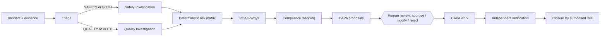

# Agents

Site Guard AI uses six bounded agents inside a fixed workflow. Agents recommend; people decide.
Code: `backend/app/agents/`.

This file describes the product's agents. The Claude Code agents used to build and review the repository
(code, security, RAG and safety-domain reviewers) are defined separately in `.claude/agents/`, with their rules in
`.claude/rules/`.

## Workflow

The orchestrator (`orchestrator.py`) runs the steps in order. It moves the incident to `PENDING_APPROVAL` and
stops. No agent can approve an action, change a risk score or close an incident.

## Bounded agent contract

Each agent (`registry.py`) declares:

| Field | Meaning |
|---|---|
| `tools` | Allowlist. Calling any other tool raises `ToolNotAllowed` and is recorded in the trace. |
| `max_tool_calls` | Budget (6 for every agent today). Exceeding it raises `BudgetExceeded`. |
| `gather` | Calls declared tools to build an *evidence pack* (incident, evidence, retrieved chunks, prior outputs). |
| output schema | Pydantic model in `schemas.py`; anything else is rejected. |
| `rules` | Deterministic decision function used offline and as the fallback. |
| `system_prompt` | Role prompt for the Claude provider. |

| Agent | Tools | Output |
|---|---|---|
| triage | get_incident, list_evidence, search_knowledge, similar_incidents | class, domain, severity, priority, hazards, missing info, next agents |
| safety | + get_prior_outputs | hazards, unsafe acts/conditions, failed controls, suggested likelihood/consequence |
| quality | + get_prior_outputs | defects, requirement vs observed, probable stage, tests, suggested likelihood/consequence |
| rca | + get_prior_outputs | 5-Whys chain, categorised root-cause hypotheses with confidence |
| compliance | + get_prior_outputs | requirements from retrieved documents with chunk citations and LIKELY_MET / LIKELY_NOT_MET / UNCLEAR |
| capa | + get_prior_outputs | corrective and preventive actions with owner role, due days, verification criteria |

Every output carries `confidence`, `evidence_refs` and `open_questions`.

## Providers

- `rules` (default): offline, deterministic, uses an explicit construction hazard/defect taxonomy (`rules.py`).
- `anthropic`: Claude (`SITEGUARD_ANTHROPIC_MODEL`, default `claude-opus-5-5`) reads the evidence pack and returns
  the agent's schema through structured outputs. The model gets no tools and no write access.

If the Claude call fails for any reason (missing key, timeout, refusal, invalid output) the rules provider answers
and the run's provider reads `rules (fallback from anthropic)`. Seeding always uses `rules`.

## Evidence and provenance

- Allowed refs are `incident:<id>`, `evidence:<id>` and `chunk:<id>` from the evidence pack only.
- Any cited ref that was not in the pack is removed, recorded in the run trace, and the run is flagged for human
  review. Runs with no citations or confidence below 0.5 are flagged too.
- Each run stores provider, output, a tool-call trace and review reasons in `agent_runs`.

## Untrusted content and prompt injection

Retrieved documents and incident text are data. Chunks matching instruction-like patterns are marked
`suspicious` at ingestion; agents never cite them and the run is flagged. The Claude provider wraps the pack in
`<evidence_pack>` tags with an instruction not to follow anything inside it.

## Knowledge answers (`POST /knowledge/answer`)

A bounded RAG answer, separate from the incident workflow (`services/answer.py`):

1. Retrieve up to 6 hits through the hybrid search, scoped to the caller's organization and project (plus
   organization-wide documents). With an `incident_id`, the incident title is added to the query.
2. Drop suspicious (instruction-like) chunks and list them under `excluded_sources`.
3. If no source contains at least a third of the question's terms, return `INSUFFICIENT_EVIDENCE` without calling
   any model.
4. The answerer drafts statements, each citing `chunk:` refs: `rules` extracts the best-matching source sentences;
   `anthropic` uses Claude with the sources wrapped in `<sources>` as untrusted data and the `AnswerDraft` schema.
   A provider failure falls back to `rules` (`provider` reads `rules (fallback from anthropic)`).
5. Every statement must cite a retrieved ref and share at least half of its terms with a cited chunk; anything else
   moves to `unsupported_claims` and is not part of the answer.
6. Statements from different documents that give different values in the same unit for the same requirement are
   reported in `conflicts`; the status becomes `CONFLICTING_EVIDENCE` and confidence is capped at 0.4.

`needs_human_review` is true unless the status is `ANSWERED`, nothing was unsupported and confidence ≥ 0.5. Every
answer carries the decision-support disclaimer and is audited as `knowledge.answer`.

## Notifications

`services/notifications.py`. `audit.record` hands every audit event to `on_audit_event`, which maps workflow events
to in-app notifications in the same transaction. Building a notification never raises: on any error it is logged
and the workflow change still commits.

| Event | Notifies | Kind |
|---|---|---|
| HIGH or CRITICAL incident reported | approvers (`APPROVE_CAPA`; `APPROVE_CRITICAL` for CRITICAL), not the reporter | `INCIDENT_REPORTED` |
| Investigation finished, actions await review | `APPROVE_CAPA` holders | `REVIEW_REQUIRED` |
| Human action proposed | approvers for its criticality | `REVIEW_REQUIRED` |
| Action approved or modified | assignee | `CAPA_ASSIGNED` |
| Action completed | `VERIFY_CAPA` holders except the assignee | `VERIFICATION_REQUIRED` |
| Verification failed | assignee | `VERIFICATION_FAILED` |
| An agent failed | the person who ran it | `AGENT_FAILED` |

Escalation rules (`escalate`, run by `python -m app.jobs escalate` or `POST /notifications/run`):

| Rule | Notifies | Once per |
|---|---|---|
| Approved action past its due date and not done | assignee, or approvers when unassigned | action and due date |
| Overdue by `SITEGUARD_ESCALATION_OVERDUE_DAYS` (7) | `APPROVE_CRITICAL` holders | action and due date |
| HIGH/CRITICAL incident still REPORTED or TRIAGED after `SITEGUARD_ESCALATION_UNREVIEWED_HOURS` (24) | `APPROVE_CRITICAL` holders | incident |
| Critical action awaiting review for `SITEGUARD_ESCALATION_REVIEW_HOURS` (48) | `APPROVE_CRITICAL` holders | action |

Escalation only notifies; it never changes an action, an incident or an approval. Every notification also gets an
email outbox row. `dispatch` sends due rows through the configured adapter (`disabled` by default, `log`, `smtp`)
with retries after 1, 5 and 25 minutes; after `SITEGUARD_NOTIFICATION_MAX_ATTEMPTS` the row is `FAILED` and an
administrator can re-queue it. With the `disabled` adapter rows are marked `SKIPPED`. `smtp` is refused when
`SITEGUARD_ENV` is local or test.

## Risk engine

`services/risk.py`, matrix version `5x5-v1`: score = likelihood x consequence; LOW <= 4, MEDIUM <= 9,
HIGH <= 16, CRITICAL >= 17. Agents only suggest the two inputs. A human can record their own assessment with
`POST /incidents/{id}/risk`; the score still comes from the matrix.

## Human approval

- AI proposals start as `PENDING_REVIEW`. Decisions: `APPROVE`, `MODIFY` (with changes), `REJECT`; a reason is
  required; the original AI output, before/after snapshot and reviewer are stored in `approval_events`.
- Actions on HIGH or CRITICAL risk incidents are `critical` and need `APPROVE_CRITICAL` (HSE manager).
- Re-running the investigation marks unreviewed AI proposals `SUPERSEDED`.
- Only approved or modified actions can be worked. The person who did an action cannot verify it.
- Closure needs: status `PENDING_VERIFICATION`, no actions awaiting review, every approved action verified
  effective, and for CRITICAL incidents the `APPROVE_CRITICAL` permission.

## Failure behaviour

An agent that raises is recorded as `FAILED`; the workflow continues with the remaining agents, the incident is
kept, and people can add actions manually (`POST /incidents/{id}/capa`) and use manual transitions.
