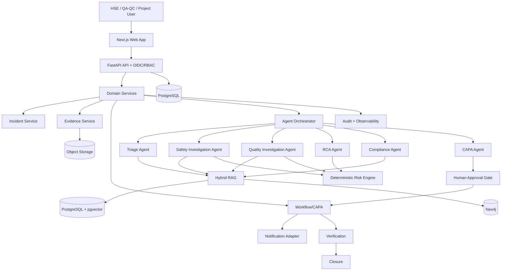

# Architecture

Source: Blueprint Part 6. The diagram below is the **target** architecture; the table after it says what is
implemented today.

## Pattern

Modular backend + responsive web app + bounded agent orchestration. Every component is deployable in containers.

## Target stack

| Layer | Target |
|---|---|
| Frontend | Next.js, React, TypeScript, Tailwind CSS |
| Backend | Python, FastAPI, Pydantic, SQLAlchemy, Alembic |
| Data | PostgreSQL, pgvector, object storage, Neo4j |
| AI | Provider abstraction for an approved enterprise LLM/VLM; Transformers/PyTorch where custom models are needed; vision adapters; stateful orchestration |
| Search / RAG | Hybrid lexical + vector search, reranking, metadata/authorization filtering, source citations |
| Workflow | Transactional application state machine for the MVP; Temporal/Camunda only if durable distributed workflows are justified later |
| DevOps | Docker, GitHub Actions, Azure Container Registry, Azure Container Apps (pilot), Azure Database for PostgreSQL, Azure Blob Storage, Azure Key Vault, Azure Monitor / Application Insights |

## Implemented today vs target

| Component | Today | Target / gap |
|---|---|---|
| Web app | Next.js 16 app in `frontend/`: same-origin BFF with an httpOnly session cookie (DECISIONS 015); dashboard, incident command center, CAPA review board, knowledge search, audit log | SSO sign-in (O1) |
| API | FastAPI, typed schemas, error envelope, correlation IDs | Same |
| Authentication | Email + password, HS256 JWT, login rate limit | OIDC / Microsoft Entra ID |
| Authorization | Server-side RBAC, 9 roles, organization/project scoping | Same |
| Database | PostgreSQL 16 (pgvector image) or SQLite; Alembic migrations | Same, plus embeddings |
| Evidence storage | Local disk under random keys, SHA-256 recorded | Azure Blob Storage adapter |
| Retrieval | BM25 lexical search with tenant/project scoping and injection flagging | Hybrid lexical + vector, reranking (Prompts 11–13) |
| Knowledge graph | None | Neo4j (Prompt 28) |
| Orchestration | Bounded sequential workflow per run (DECISIONS 007); runs and traces stored | Stateful orchestration with checkpoints if needed |
| AI providers | Rules (default, offline) and Claude behind one `Provider` interface, with fallback | Same abstraction; VLM adapters for vision |
| Risk | Deterministic 5x5 matrix, versioned | Same |
| Workflow | Transactional incident and CAPA state machines | Same; reminders and escalation (Prompt 24) |
| Notifications | None (overdue counts on the dashboard) | Notification adapter |
| Vision | None | PPE/hazard and defect detection (Prompts 25–27) |
| Observability | JSON logs, correlation IDs, audit events, agent traces | Metrics, OpenTelemetry, App Insights |
| Deployment | Docker image, Compose, GitHub Actions | Azure (Prompts 45–46) |

## Agent components

Triage; Safety Investigation; Quality Investigation; RCA; Compliance; CAPA. Responsibilities, tools, budgets,
schemas and failure behaviour are in `docs/AGENTS.md`.

Every agent specifies: allowed tools; input (evidence pack) and output schema; evidence requirements; uncertainty
fields; maximum execution budget; failure behaviour; human-review conditions.

## Data flow

Incident → evidence → retrieval → agents → risk / RCA / compliance → approval → workflow → verification → closure.

## Dependency rules

- The UI never accesses the database directly and never decides authorization.
- Agents use approved service/tool interfaces only (allowlisted per agent).
- Provider-specific code stays behind adapters (`app/agents/llm.py`).
- Routes (`app/api/`) stay thin; business rules live in `app/services/`.
