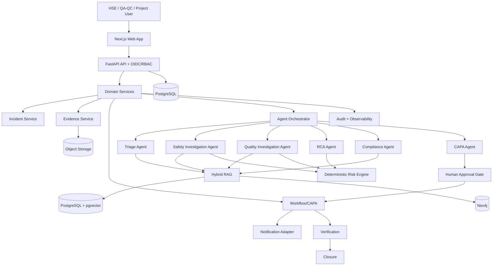

# Architecture

## Pattern

Modular backend + responsive web app + stateful agent orchestration. Keep components deployable in containers.

## Stack

Next.js; React; TypeScript; Tailwind; Python; FastAPI; Pydantic; SQLAlchemy; PostgreSQL; pgvector; Neo4j; object storage; Docker; GitHub Actions; Azure.

## Agent Components

Triage; Safety Investigation; Quality Investigation; RCA; Compliance; CAPA.

## Data Flow

Incident → evidence → retrieval → agents → risk/RCA/compliance → approval → workflow.

## Dependency Rules

UI does not access the database directly. Agents use approved service/tool interfaces. Provider-specific code stays behind adapters.
