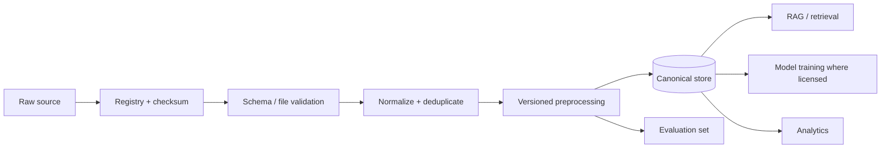

# Site Guard AI Dataset & Resource Register — FINAL UPDATED

**Verified:** 09 October 2026


## Current Construction Dataset and Resource Register — verified 09 October 2026

> **Important:** A source being public does not automatically grant commercial-use rights. Every dataset must be registered with source, access date, version, checksum, license and allowed use before it enters the product pipeline. Recent release/publication year is tracked separately from the age of the underlying observations.

| Resource | Current/recent date | What it provides | Site Guard use | Extraction / preparation | Commercial-product treatment |
|---|---:|---|---|---|---|
| OSHA Injury Tracking Application (ITA) | 2025 data currently published in 2026 | Establishment summary + case-detail work-related injury/illness data; case-detail records can include OIICS/SOC enrichment | Incident taxonomy, analytics, evaluation, benchmark context | Download official Summary/Case Detail files; preserve raw copy; validate data dictionary; normalize codes/dates; map only approved taxonomy fields | Use for analysis/evaluation under source terms; do not infer individual liability or “dangerous employer” from rates |
| BLS Census of Fatal Occupational Injuries (CFOI) | 2024 results released Feb 2026 | Fatal work injury tables by event/exposure, occupation, industry and demographics | Construction fatality benchmarks, event taxonomy, evaluation context | Download XLSX/HTML tables; preserve table name/year; normalize dimensions; store aggregate metrics | Statistical benchmark; do not turn aggregate counts into incident facts |
| HSE work-related fatal injuries | 2025/26 provisional, published 2026 | RIDDOR worker fatal injury statistics by industry/kind of accident; downloadable supporting tables | UK benchmark, risk taxonomy, management dashboard context | Download supporting XLSX tables; preserve provisional/revised status; map accident kind taxonomy | Statistical/reference use; do not treat provisional counts as final |
| HSE construction statistics | 2024/25 provisional, release cycle 2025/26 | Construction injuries, fatality rates and accident kinds | Construction-specific benchmark and safety presentation data | Store PDF/XLSX source; page-aware extraction; preserve release status | Reference/benchmark use under HSE terms |
| NIOSH FACE | Current resources in 2026 | Fatal occupational incident investigation narratives and recommendations | RCA examples, safety knowledge retrieval, case-based reasoning evaluation | Acquire approved reports; page-aware text extraction; preserve title/date/page; chunk into evidence records | Use as source material subject to publisher terms; do not auto-claim universal applicability |
| DGFASLI Standard Reference Note 2024 | 2024 | India-oriented occupational safety/accident reference material | India safety taxonomy/context and presentation support | Download official PDF; extract pages/tables; retain section/page provenance | Government reference; use only within applicable terms |
| MoSPI PLFS 2025 Annual Report | 2025 report published 2026 | Indian labour-force/industry context including NIC-2008 construction classification | Industry/workforce denominator context, market characterization | Download official PDF; extract construction classification and approved aggregates | Context dataset; not an incident ground-truth dataset |
| ConstructionSite 10k | 2026 | 10,013 construction-site images; captions, visual grounding and safety-rule tasks | VLM evaluation, construction scene understanding, safety-vision research | Use Hugging Face `datasets`; retain official train/test split; validate schema; keep test untouched for evaluation | Current card lists CC BY-NC 4.0; **research/evaluation unless separate commercial rights are obtained** |
| ConSynth-X | 2026 | Synthetic construction-site images for robustness under fog/rain/snow/night/small-object conditions | Vision robustness and red-team testing | Reproduce only the documented reconstruction/provenance flow; preserve upstream attribution and condition labels | Current terms are non-commercial/gated; **research/red-team unless rights change** |
| SH17 | 2024 dataset / 2025 research publication | 8,099 annotated images, 75,994 instances, 17 PPE/body classes | PPE detection baseline | Download according to repository instructions; convert labels to YOLO/COCO; preserve source metadata and splits | Repository states CC BY-NC-SA 4.0; **research/evaluation** |
| CUBIT-Det / CUBIT-Seg | 2024 benchmark | High-resolution building/pavement/bridge crack, spalling and moisture detection/segmentation | Quality-vision baseline and segmentation | Download source/annotations; preserve original split; convert to model format through versioned scripts | CUBIT-Det repository states CC BY 4.0; verify exact terms for every component before commercial use |
| 2025 concrete-crack dataset | 2025 | 1,132 manually classified beam/column crack images; five failure classes | Quality defect detection/classification | Preserve image/label pairs; parse `.txt` labels and bounding-box fields; record laboratory provenance | Open-access article/dataset; verify the exact license/rights of the repository before commercial use |
| PAGG-Net concrete crack dataset | Dec 2025; metadata created 2026 | High-resolution images + pixel-wise crack masks + multi-scale tiles | Crack segmentation and high-resolution inspection research | Preserve image/mask pairing, image-level train/val/test split, MD5 hashes; use tiles only through documented mapping | Current record indicates copyright rather than a blanket commercial license; **research unless permission obtained** |
| SODA (established baseline) | Older | Construction-object detection benchmark | Baseline comparison only | Use published split/format and cite source | Do not present as a 2024–2026 dataset; verify terms before use |

### Recommended Site Guard dataset roles

1. **Training/fine-tuning:** only datasets with confirmed permission for the intended use.
2. **RAG knowledge:** authoritative regulations, company-approved procedures, HSE plans, JSA/JHA, ITPs, specifications and approved reports.
3. **Evaluation:** public incident statistics, ConstructionSite 10k, defect datasets and curated expert-labeled cases.
4. **Red-team:** ConSynth-X, synthetic incident cases, contradictory documents and malicious prompts.
5. **Product analytics:** customer-owned incident/near-miss/inspection/CAPA data under a data-processing agreement and tenant isolation.

### Machine-readable registry

Create `data/dataset_registry.yaml`:

```yaml
- id: osha_ita_2025
  name: OSHA Injury Tracking Application 2025
  publisher: OSHA
  source_url: https://www.osha.gov/itadata
  release_date: "2026"
  observation_period: "2025"
  access_date: "09 October 2026"
  version: "current-2025-release"
  modality: "tabular"
  license: "see source terms"
  commercial_use: "review-required"
  purpose: ["analytics", "evaluation", "taxonomy"]
  raw_location: "data/raw/government/osha/"
  processed_location: "data/processed/government/osha/"
  extraction_method: "official CSV/XLSX -> schema validation -> normalization"
  limitations: "Not fully representative of all employers; submitted data can contain unresolved errors."

- id: constructionsite_10k
  name: ConstructionSite 10k
  publisher: "Chen/Zou"
  source_url: https://huggingface.co/datasets/LouisChen15/ConstructionSite
  release_date: "2026"
  access_date: "09 October 2026"
  version: "recorded-repository-revision"
  modality: "image+text"
  license: "CC BY-NC 4.0 (dataset card)"
  commercial_use: "not-allowed-unless-permission"
  purpose: ["vision-evaluation", "VLM-research"]
  raw_location: "data/raw/vision/constructionsite_10k/"
  processed_location: "data/processed/vision/constructionsite_10k/"
  extraction_method: "Hugging Face datasets -> schema validation -> split-preserving export"
  limitations: "Research dataset; not sufficient to establish real-world safety compliance."
```

### Extraction pipeline




## Product data policy

The deployed product should prefer:

1. Customer-owned/project-owned data under contract.
2. Explicitly commercially licensed datasets.
3. Public government statistics for aggregate benchmarks.
4. Research-only datasets for evaluation where licensing is restrictive.
5. Synthetic scenarios for edge-case and red-team testing.

## Data lifecycle

```text
Acquire
→ Register
→ Check license
→ Checksum
→ Validate
→ Normalize
→ Version
→ Evaluate
→ Store
→ Use
→ Monitor
```

## RAG document lifecycle

```text
PDF / HTML / DOCX
→ Parse
→ Page/section metadata
→ Chunk
→ Embed
→ Hybrid search
→ Rerank
→ Access filter
→ Evidence citation
→ Agent
```

## Vision lifecycle

```text
Image dataset
→ Preserve official split
→ Validate annotations
→ Convert labels
→ Train/evaluate where licensed
→ Store model version
→ Run inference
→ Return observation + confidence + source image
```
