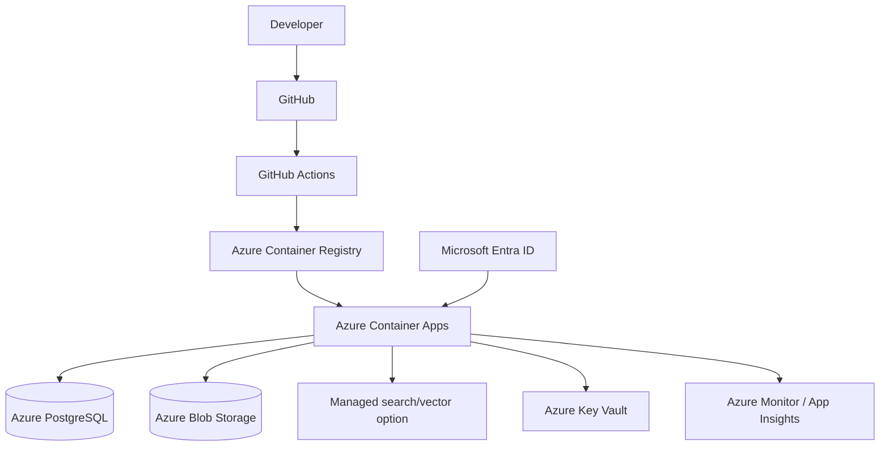

# Deployment

## Target

Docker + GitHub Actions + Azure Container Registry + Azure Container Apps + managed PostgreSQL + Blob Storage + Key Vault + Monitor.

## Flow

Test → Build → Scan → Push → Staging → Migrate → Smoke test → Approval → Production.

## Rollback

Use versioned container image and database migration strategy. Never perform destructive rollback blindly.

## What exists today (0.1.0)

- `backend/Dockerfile`: non-root image installed from `requirements.lock`, health check, migrations applied on
  startup, seed data baked in (seeds only when `SITEGUARD_ENV` is local/test/demo or
  `SITEGUARD_SEED_DEMO_DATA=true`; refused in production).
- `docker-compose.yml`: PostgreSQL 16 with pgvector + API, verified locally with the walkthrough script.
- `.github/workflows/ci.yml`: lint, type check, tests, image build and an end-to-end smoke run.

## Azure pilot steps (next milestone)

1. Create Azure Container Registry, a Container Apps environment, Azure Database for PostgreSQL Flexible Server,
   a Storage account and Key Vault.
2. Push the image from CI to ACR on `main`.
3. Container App settings: `SITEGUARD_DATABASE_URL`, `SITEGUARD_JWT_SECRET` and `ANTHROPIC_API_KEY` from Key
   Vault; `SITEGUARD_ENV=staging` (or `demo` for the presentation environment, which seeds demo data).
4. Mount Azure Files (or switch the evidence adapter to Blob Storage) at `SITEGUARD_EVIDENCE_DIR`.
5. Smoke test `/health`, then run `scripts/demo_walkthrough.py --base-url <staging-url>`.
