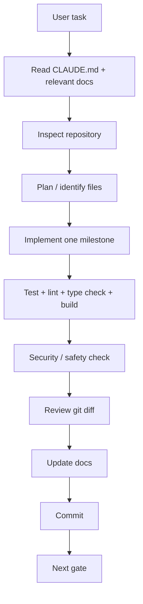

# 02 — Site Guard AI GitHub Repository Strategy — FINAL UPDATED

## Repository

https://github.com/sricharansk/SITEGUARD-AI

## Recommended model

Keep Site Guard AI in its own repository.

```text
GitHub
├── SITEGUARD-AI
└── CLAIM-SENSE-AI
```

This makes each project independently demonstrable, testable and deployable.

## Repository structure

```text
SITEGUARD-AI/
├── README.md
├── CLAUDE.md
├── .env.example
├── docker-compose.yml
├── frontend/
├── backend/
├── tests/
├── evals/
├── data/
├── scripts/
├── deployment/
├── docs/
└── .claude/
```

## Claude Code workflow





## Initial commands

```bash
git clone https://github.com/sricharansk/SITEGUARD-AI.git
cd SITEGUARD-AI
claude
```

Create feature branch:

```bash
git checkout -b feature/incident-intake
```

After validation:

```bash
git add .
git commit -m "feat: implement incident intake"
git push -u origin feature/incident-intake
```

## GitHub must contain

- source code;
- documentation;
- tests;
- evaluation scripts;
- deployment configuration;
- sanitized demo data;
- architecture diagrams;
- release history.

## Do not commit

```text
.env
API keys
passwords
database credentials
private company documents
client data
worker PII
restricted datasets
confidential architecture
```

## Public portfolio strategy

Use:
- your own implementation;
- public/permissively licensed data;
- synthetic customer examples;
- screenshots;
- architecture;
- evaluation results.

Check company policy before publishing anything created during company training.

## Recommended release history

```text
v0.1.0 — skeleton
v0.2.0 — RAG
v0.3.0 — multi-agent MVP
v0.4.0 — workflow
v0.5.0 — multimodal
v0.6.0 — deployment
v1.0.0 — product pilot
```
